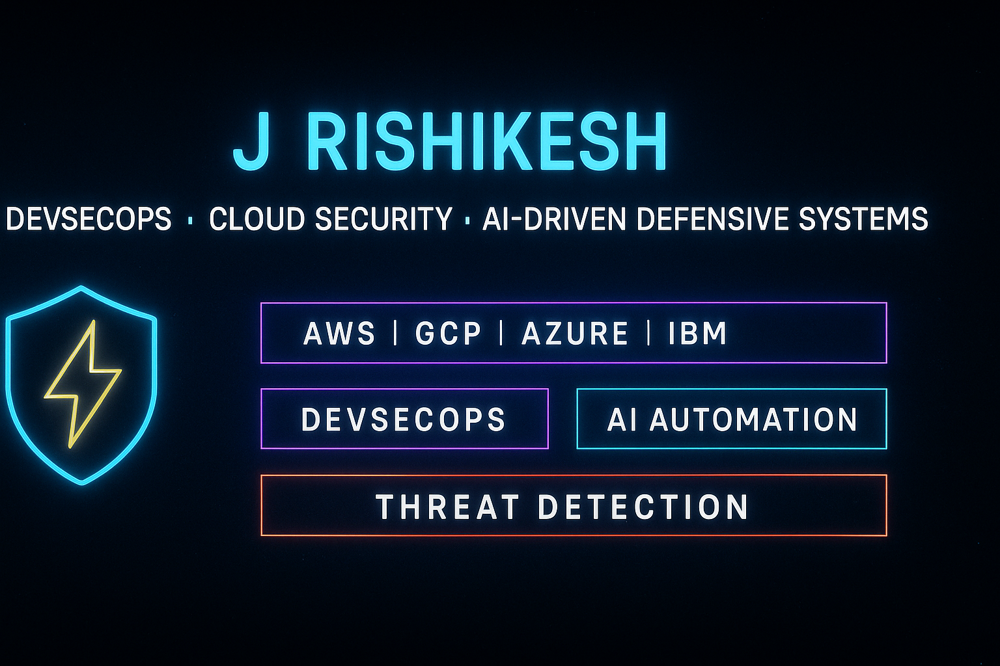
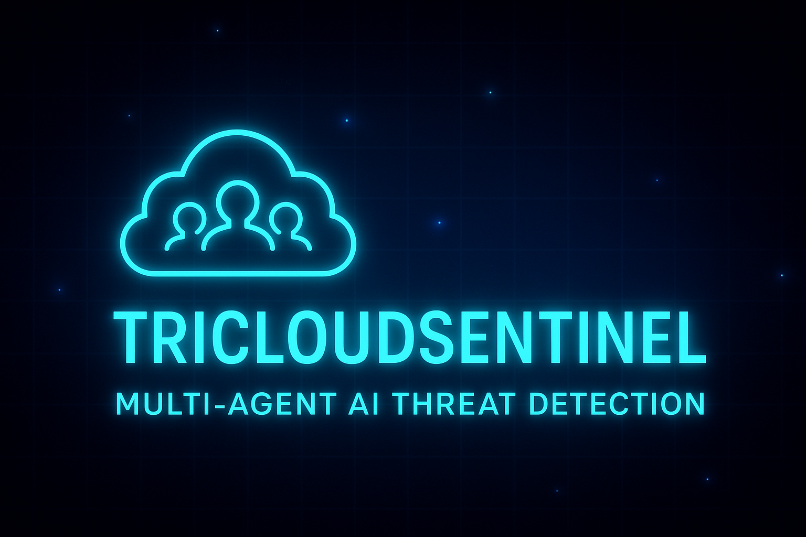
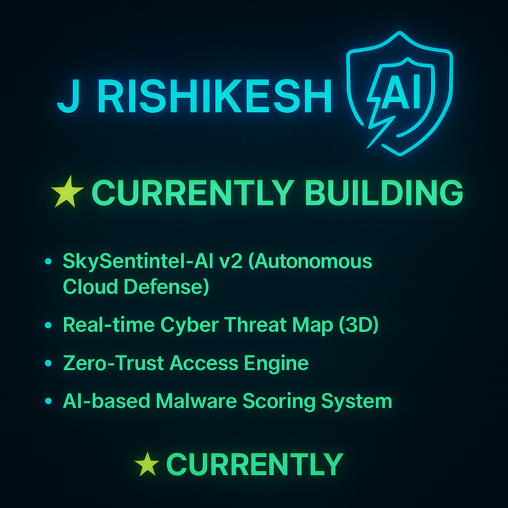

  

  
  
  

---

  

---

## 🔥 **Featured Cloud Security Projects**

---

### 🛡️ **Fail2Ban-AWS — Intelligent Log-Based Intrusion Mitigation**

  

---

### 🤖 **TriCloudSentinel — Multi-Agent AI Threat Detection**

  

---

## ⚙️ **Tech Stack**

  

---

## 🚧 **Currently Building**

  

---

## 🐍 **Contribution Snake**
> *(Your snake is now hosted in the `output` branch and working.)*

  

---

## 🔥 **Live Activity Heatmap**

  

---

## 📬 Connect With Me

  
  &nbsp;&nbsp;&nbsp;&nbsp;
  

  <i>“AI-Driven Cloud Security is the future — and I’m building it.”</i>

