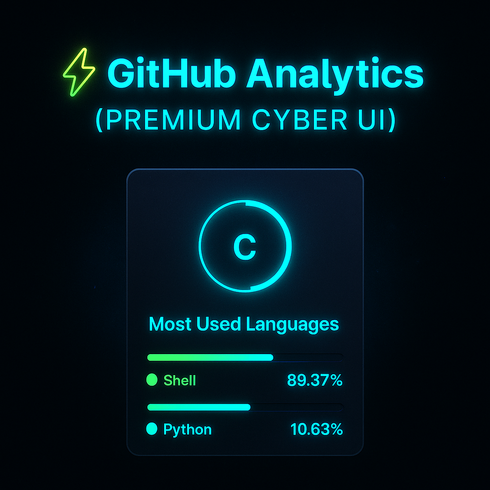

<p align="center">
  <a href="https://github.com/SkySentinel-AI/TriCloudSentinel-demo">
    
  </a>
</p>

<div align="center">
  
  
  
</div>

# <div align="center">☁️ J Rishikesh — SkySentinel-AI</div>
### <div align="center">DevSecOps • Cloud Security Engineer • AI-Driven Cloud Defense</div>

> <div align="center">_“AI-Driven Cloud Security is the future — and I’m building it.”_</div>

---

# <div align="center">✨ Featured Visuals</div>

<p align="center">
  <a href="https://github.com/SkySentinel-AI/featured-projects">
    
  </a>
</p>

<p align="center">
  <a href="https://github.com/SkySentinel-AI/fail2ban-aws">
    
  </a>
</p>

<p align="center">
  <a href="https://github.com/SkySentinel-AI/TriCloudSentinel-demo">
    
  </a>
</p>

<p align="center">
  <a href="https://github.com/SkySentinel-AI">
    
  </a>
</p>

<p align="center">
  
</p>

---

# <div align="center">📊 GitHub Analytics & Live Visuals</div>

<p align="center">
  
</p>

<p align="center">
  
</p>

<p align="center">
  
</p>

---

# <div align="center">🔥 Quick Project Summary</div>

### **TriCloudSentinel — AI Multi-Agent Threat Detection**
- 3 autonomous detection agents (containerized)
- Ensemble AI scoring (60s rolling window)
- Safety Gate auto-remediation (Azure / GCP / IBM)
- Prometheus Metrics + Grafana Cloud remote_write
- Docker Compose orchestration

### **Fail2ban AWS**
- Cloud-based IP blocking automation  
- Event → Detect → Block flow  
- Lightweight security PoC for cloud hosts

---

# <div align="center">🛠️ Run Locally</div>

```bash
docker compose up -d --force-recreate --build

docker compose ps

# ensemble health + metrics
curl -i http://localhost:9000/health
curl -i http://localhost:9000/metrics
```

---

# <div align="center">📬 Connect With Me</div>

<p align="center">
  <a href="https://linkedin.com/in/j-r-306ba635b">
    
  </a>
  &nbsp;&nbsp;
  <a href="mailto:jogdandrishikesh05@gmail.com">
    
  </a>
</p>
