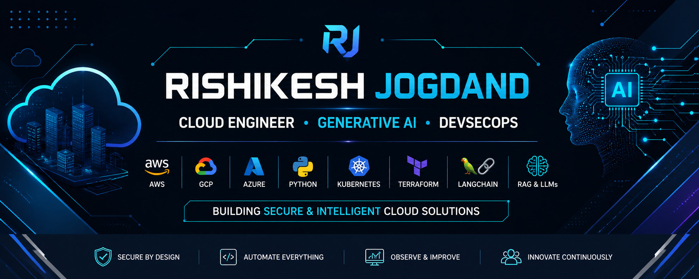

<div align="center">

# 👋 Hi, I'm Rishikesh Jogdand

### ☁️ Cloud Engineer • 🤖 Generative AI • 🔐 DevSecOps • 🚀 AI Infrastructure



### Building secure cloud platforms and intelligent AI applications.

📍 Pune, India 🇮🇳  
🌍 Open to Remote • Hybrid • On-site Opportunities

<p>

<a href="https://linkedin.com/in/j-r-306ba635b">

</a>

<a href="mailto:jogdandrishikesh05@gmail.com">

</a>

<a href="https://github.com/SkySentinel-AI">

</a>

<a href="https://x.com/RishiAIXCloud">

</a>

</p>

</div>

---

# 🚀 About Me

I'm a Cloud Engineer passionate about building secure cloud infrastructure and practical AI-powered applications.

My engineering experience includes:

- ☁️ Cloud Infrastructure
- ⚙️ Infrastructure as Code
- 🔐 DevSecOps & Cloud Security
- 🤖 Generative AI Applications
- 🚀 Platform Engineering

Recently, I've expanded into Generative AI by building projects using LangChain, Retrieval-Augmented Generation (RAG), Gemini API, Hugging Face, and Streamlit.

I enjoy solving engineering problems through automation, security, and AI-driven solutions that are scalable, maintainable, and production-focused.

---

# 🛠 Tech Stack

## ☁️ Cloud

<p>


</p>

---

## ⚙️ DevOps & Platform Engineering

<p>


</p>

---

## 🤖 Generative AI

- LangChain
- Gemini API
- Retrieval-Augmented Generation (RAG)
- Hugging Face Transformers
- FAISS Vector Database
- Prompt Engineering
- Streamlit

---

## 💻 Programming

<p>


</p>

---

## 🔐 Security

- IAM
- AWS GuardDuty
- Trivy
- Checkov
- tfsec
- SonarQube
- Security Automation

---

# 🚀 Featured Projects

| Project | Description |
|----------|-------------|
| 🛡️ **TriCloudSentinel** | Multi-cloud security monitoring platform |
| ☁️ **Fail2Ban AWS** | Automated cloud incident response |
| 🤖 **GenAI Learning Lab** | Prompt Engineering, LangChain, Gemini, RAG & Hugging Face projects |
| 📄 **RAG PDF Chatbot** | AI-powered document assistant using LangChain + FAISS |
| 🎉 **AI Greeting Card** | Streamlit application powered by Gemini |

---

# 🏆 Certifications

### Google Cloud

- Introduction to Security Principles in Cloud Computing
- Generative AI: Beyond the Chatbot

### ExcelR

- Generative AI + Prompt Engineering + ChatGPT *(Completed: 17 July 2026)*

---

# 🌱 Currently Building

- 🤖 AI Agents
- 🧠 LangGraph
- 📄 Enterprise RAG Applications
- 🚀 LLMOps
- ☁️ AI Infrastructure
- 🔐 AI Security

---

# 💡 Engineering Philosophy

> Secure by Design

> Automate Everything

> Build for Reliability

> Keep Learning

> Ship Practical Solutions

---

# 📈 GitHub Journey

```text
Cloud Engineering
        │
        ▼
DevSecOps
        │
        ▼
Generative AI
        │
        ▼
Enterprise RAG
        │
        ▼
AI Infrastructure
```

---

# 🤝 Let's Connect

<p align="center">

<a href="https://linkedin.com/in/j-r-306ba635b">

</a>

<a href="mailto:jogdandrishikesh05@gmail.com">

</a>

<a href="https://x.com/RishiAIXCloud">

</a>

</p>

---

<div align="center">

## ⭐ Building Secure Cloud Platforms & Intelligent AI Applications ⭐

*"Learn continuously. Build thoughtfully. Deliver reliably."*

</div>
